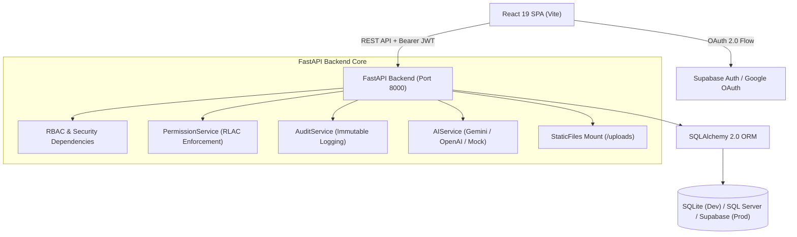

# 🏥 AI Care Coordination Platform

> A full-stack, enterprise-grade healthcare coordination ecosystem featuring role-tailored portals (Patient, Doctor, Hospital Admin, Laboratory, Pharmacy), granular resource-level access control (RLAC), immutable audit logging, and clinician-verified AI assistance.

[](https://python.org)
[](https://fastapi.tiangolo.com)
[](https://react.dev)
[](https://vitejs.dev)
[](https://www.sqlalchemy.org)
[](backend/tests)
[](LICENSE)

---

## 📋 Table of Contents
1. [Overview](#-overview)
2. [Key Features](#-key-features)
3. [System Architecture](#-system-architecture)
4. [Tech Stack](#-tech-stack)
5. [Project Structure](#-project-structure)
6. [Prerequisites](#-prerequisites)
7. [Installation & Setup](#-installation--setup)
8. [Configuration](#-configuration)
9. [Usage & Test Accounts](#-usage--test-accounts)
10. [API Documentation](#-api-documentation)
11. [Testing](#-testing)
12. [Deployment](#-deployment)
13. [Demo & Screenshots](#-demo--screenshots)
14. [Roadmap](#-roadmap)
15. [Contributing](#-contributing)
16. [License](#-license)
17. [Author & Contact](#-author--contact)

---

## 🎯 Overview

Healthcare data is often fragmented across disparate clinical silos, visiting doctors, commercial laboratories, and pharmacies. This lack of centralized coordination risks medical errors, delays treatment, and compromises patient privacy.

The **AI Care Coordination Platform** solves these challenges by providing an end-to-end, privacy-preserving healthcare operations hub:

- **Patient Sovereignty**: Patients possess full ownership of their medical history and grant explicit, time-limited access permissions to clinicians per resource type.
- **Five Dedicated Role Portals**: Tailored interfaces for **Patients**, **Doctors**, **Hospital Administrators**, **Laboratory Technicians**, and **Pharmacists**.
- **Clinician-in-the-Loop AI**: Care coordination recommendations (powered by Google Gemini or OpenAI) are generated as `PENDING` drafts and require doctor review and sign-off before entering authoritative clinical workflows.
- **HIPAA-Aligned Access Auditing**: Every sensitive query, record view, and report download is recorded in an immutable `AccessAuditLog`.
- **Hybrid Database Architecture**: Runs zero-config on SQLite for local development and unit tests, with native support for Microsoft SQL Server (via `pyodbc`) and PostgreSQL / Supabase for enterprise deployment.

---

## ✨ Key Features

### 👤 Patient Portal
- **Health Overview Dashboard**: Immediate visibility into upcoming appointments, active prescriptions, recent lab reports, and clinical history.
- **Privacy & Consent Manager**: Review incoming doctor access requests, configure granular permissions (`CanView`, `CanAdd`, `CanEdit`), define expiration dates, or revoke doctor access with a single click.
- **Consultation Scheduling**: Book appointments with specialists and track consultation statuses.
- **AI Health Assistant**: Ask questions and receive instant healthcare guidance with automated clinical disclaimers.
- **Profile Management**: Maintain personal contact details, emergency contacts, and blood group information.

### 🩺 Doctor & Clinician Suite
- **Authorized Patient Directory**: View and filter only patients who have granted active consent.
- **Clinical Records & Diagnoses**: Document clinical notes, record symptoms, and assign ICD-10 diagnosis codes.
- **Prescription Ordering**: Issue multi-item medication orders linked to a standardized drug catalog.
- **Doctor AI Review Queue**: Inspect and validate or reject AI-generated clinical care coordination recommendations.

### 🔬 Laboratory Portal
- **Diagnostic Test Orders**: Track lab orders across stages (`ORDERED`, `IN_PROGRESS`, `COMPLETED`, `CANCELLED`).
- **Secure Report Uploads**: Upload diagnostic attachments (PDF, PNG, JPG) with size limits (10MB) and MIME validation.

### 💊 Pharmacy Portal
- **Fulfillment Pipeline**: Process medication orders through a status lifecycle (`PENDING` ➔ `PROCESSING` ➔ `READY` ➔ `COMPLETED`).
- **Medicine Catalog**: Searchable database of 40+ international medicines with dosage forms, generic names, and therapeutic categories.

### 🛡️ Administration & Compliance
- **Immutable Access Audit Trail**: Complete record of user actions (`VIEW`, `ADD`, `EDIT`, `DELETE`, `DOWNLOAD`), target patient IDs, and UTC timestamps.
- **User & Organization Administration**: Register and manage healthcare organizations, clinics, and hospital staff.

---

## 🏗️ System Architecture



### Data Access Lifecycle
1. **Request**: Doctor requests access to a patient record (`POST /api/access-requests`).
2. **Consent**: Patient approves the request (`PATCH /api/access-requests/{id}/approve`), establishing an active `PatientDoctorAccess` record with configured permissions.
3. **Enforcement**: When doctor accesses patient records (`GET /api/medical-records`), `PermissionService` verifies the active link and expiration date (`ExpiresAt > now()`).
4. **Audit**: `AuditService` logs the access event into `AccessAuditLogs`.

---

## 🧪 Tech Stack

| Domain | Technology | Purpose |
| :--- | :--- | :--- |
| **Frontend Framework** | [React 19](https://react.dev/) | Component-based SPA architecture |
| **Frontend Build Tool** | [Vite 8.3](https://vitejs.dev/) | Lightning-fast HMR and production bundling |
| **Routing** | [React Router v7](https://reactrouter.com/) | Client-side routing and layout management |
| **Icons & UI** | [Lucide React](https://lucide.dev/) | Healthcare UI iconography |
| **Styling** | Vanilla CSS | Custom design system with glassmorphism, responsive themes, and micro-animations |
| **Backend Framework** | [FastAPI 0.110+](https://fastapi.tiangolo.com/) | High-performance asynchronous REST API |
| **ASGI Server** | [Uvicorn](https://www.uvicorn.org/) | Production-grade ASGI server |
| **ORM & Database** | [SQLAlchemy 2.0](https://www.sqlalchemy.org/) | Schema mapping, relational joins, and connection pooling |
| **Database Engines** | SQLite (dev) / SQL Server / Postgres | Local zero-config SQLite fallback, enterprise SQL Server via `pyodbc` |
| **Authentication** | [PyJWT](https://pyjwt.readthedocs.io/) & [Passlib](https://passlib.readthedocs.io/) | Stateless JWT tokens and secure password hashing (PBKDF2/Bcrypt) |
| **OAuth 2.0** | [@supabase/supabase-js](https://supabase.com/) | Google SSO and federated authentication |
| **AI Integration** | [google-generativeai](https://pypi.org/project/google-generativeai/) / [openai](https://pypi.org/project/openai/) | Clinical draft assistance with offline fallback |
| **Testing** | [pytest 8+](https://docs.pytest.org/) & [httpx](https://www.python-httpx.org/) | Automated integration tests with in-memory SQLite isolation |

---

## 📂 Project Structure

```
Health-Coordination-System/
├── backend/
│   ├── app/
│   │   ├── dependencies/       # Authentication & role-based access dependencies (auth_deps.py)
│   │   ├── models/             # 20 SQLAlchemy database models (User, Patient, Doctor, etc.)
│   │   ├── routers/            # 16 FastAPI router modules (auth, patients, doctors, etc.)
│   │   ├── schemas/            # Pydantic schemas for request validation & serialization
│   │   ├── security/           # Password hashing (passwords.py) & JWT creation (jwt.py)
│   │   ├── services/           # Business logic: AI service, audit logger, permission enforcer
│   │   ├── utils/              # File storage handler with extension whitelist
│   │   ├── config.py           # Environment settings via Pydantic BaseSettings
│   │   ├── database.py         # SQLAlchemy engine, SessionLocal, and DB dependency
│   │   └── main.py             # FastAPI entry point, CORS middleware, router registration
│   ├── tests/
│   │   └── test_backend.py     # Automated pytest suite covering auth, appointments, and permissions
│   ├── uploads/                # Directory for uploaded lab report documents (retained via .gitkeep)
│   ├── .env.example            # Backend environment template
│   ├── pytest.ini              # Pytest configuration (scopes test discovery to tests/)
│   ├── requirements.txt        # Python backend dependencies
│   ├── seed.py                 # Seeds initial fictional database records across all roles
│   ├── supabase_schema.sql     # PostgreSQL/Supabase production schema definition
│   └── update_seed_medicines.py# Seeds 40+ international medicines into catalog
│
├── frontend/
│   ├── public/                 # Static assets (favicon.svg, icons.svg)
│   ├── src/
│   │   ├── assets/             # Branding assets
│   │   ├── components/         # Reusable UI components (Navbar, Footer, Badge, Modal, etc.)
│   │   ├── context/            # React Context providers (ThemeContext, ToastContext)
│   │   ├── data/               # World medicine catalog dataset (worldMedicines.js)
│   │   ├── pages/              # 30 page views covering all role portals and dashboards
│   │   ├── services/           # Centralized API client (api.js) and Supabase client (supabase.js)
│   │   ├── styles/             # Modular CSS stylesheets (Auth.css, Dashboard.css, Navbar.css)
│   │   ├── utils/              # Role-filtering helper (roleFilter.js)
│   │   ├── App.jsx             # Main routing component
│   │   ├── index.css           # Global CSS variables and design tokens
│   │   └── main.jsx            # React root mount point
│   ├── .env.example            # Frontend environment template
│   ├── package.json            # Node dependencies and scripts
│   └── vite.config.js          # Vite build configuration
│
├── .gitignore                  # Git ignore rules for node_modules, caches, and upload files
├── README.md                   # Project documentation
└── start_app.bat               # Windows launcher script starting backend and frontend concurrently
```

---

## ⚙️ Prerequisites

- **Python**: Version `3.12` or higher (tested on Python `3.14`)
- **Node.js**: Version `18.0.0` or higher
- **npm**: Version `9.0.0` or higher
- **Git**: Installed and configured
- *(Optional)* **Microsoft SQL Server**: Required only if connecting to SQL Server instead of the built-in SQLite database

---

## 🚀 Installation & Setup

### 1. Clone the Repository

```bash
git clone https://github.com/saiashish13/Health-Coordination-System.git
cd Health-Coordination-System
```

### 2. Backend Setup

```bash
# Navigate to backend directory
cd backend

# Create a virtual environment
python -m venv venv

# Activate the virtual environment
# On Windows (PowerShell / Command Prompt):
venv\Scripts\activate
# On macOS / Linux:
source venv/bin/activate

# Install dependencies
pip install -r requirements.txt

# Create environment configuration
cp .env.example .env
```

### 3. Seed Database

Initialize database tables and populate fictional test accounts:

```bash
# Seed initial users, appointments, medical records, and permission links
python seed.py

# (Optional) Seed the global medicine catalog
python update_seed_medicines.py
```

### 4. Frontend Setup

Open a separate terminal window:

```bash
# Navigate to frontend directory
cd frontend

# Install Node dependencies
npm install

# Create environment configuration
cp .env.example .env
```

---

## 🔧 Configuration

### Backend Environment Variables (`backend/.env`)

| Variable | Required | Default / Example | Purpose |
| :--- | :---: | :--- | :--- |
| `PROJECT_NAME` | No | `AI Care Coordination Platform Backend` | Display title for API documentation |
| `VERSION` | No | `1.0.0` | API version string |
| `DATABASE_URL` | No | `sqlite:///./healthcare.db` | Overrides database connection string (SQLite, PostgreSQL, or SQL Server) |
| `DB_SERVER` | No | `""` | SQL Server host (leave blank to use SQLite) |
| `DB_PORT` | No | `1433` | SQL Server port |
| `DB_NAME` | No | `HealthcareDB` | SQL Server database name |
| `DB_USER` | No | `sa` | SQL Server username |
| `DB_PASSWORD` | No | `""` | SQL Server password |
| `DB_DRIVER` | No | `ODBC Driver 18 for SQL Server` | Installed ODBC driver name |
| `JWT_SECRET` | **Yes** | `super-secret-key-change-in-production-ai-care-platform-2026` | Secret key for signing access tokens |
| `JWT_ALGORITHM` | **Yes** | `HS256` | JWT signature algorithm |
| `ACCESS_TOKEN_EXPIRE_MINUTES`| **Yes** | `120` | Session token lifetime in minutes |
| `FRONTEND_URL` | No | `http://localhost:5173` | Allowed origin for CORS headers |
| `AI_PROVIDER` | No | `mock` | AI engine (`mock`, `google`, or `openai`) |
| `AI_API_KEY` | No | `""` | API key for Google Gemini or OpenAI |
| `SUPABASE_URL` | No | `https://your-project.supabase.co` | Supabase project endpoint |
| `SUPABASE_PUBLISHABLE_KEY` | No | `sb_publishable_...` | Supabase publishable/anon key |

### Frontend Environment Variables (`frontend/.env`)

| Variable | Required | Default / Example | Purpose |
| :--- | :---: | :--- | :--- |
| `VITE_API_URL` | **Yes** | `http://localhost:8000/api` | Base URL of the running FastAPI backend |
| `VITE_SUPABASE_URL` | No | `https://your-project.supabase.co` | Supabase endpoint for Google OAuth |
| `VITE_SUPABASE_ANON_KEY` | No | `your_supabase_anon_key_here` | Supabase anonymous public key |

---

## 💻 Usage & Test Accounts

### Starting the Application

#### Option A: One-Click Concurrent Execution (Windows)
Double-click `start_app.bat` in the repository root, or run:

```cmd
.\start_app.bat
```
This automatically frees port `8000` and `5173`, launches the FastAPI backend, and starts the Vite development server in dedicated terminal windows.

#### Option B: Manual Execution

**Terminal 1 — Backend:**
```bash
cd backend
python -m uvicorn app.main:app --reload --host 0.0.0.0 --port 8000
```
- API Root: `http://localhost:8000`
- Interactive Swagger Docs: `http://localhost:8000/docs`
- ReDoc Docs: `http://localhost:8000/redoc`

**Terminal 2 — Frontend:**
```bash
cd frontend
npm run dev
```
- Web Application: `http://localhost:5173`

---

### Pre-Configured Test Accounts

The seeder (`seed.py`) provisions pre-configured test accounts for each role:

| Role | Email | Password | Primary Capabilities |
| :--- | :--- | :--- | :--- |
| **PATIENT** | `patient@healthcare.com` | `password123` | Personal health records, appointment bookings, consent manager, AI assistant |
| **DOCTOR** | `doctor@healthcare.com` | `password123` | Patient list, clinical notes, diagnosis creation, AI draft review queue |
| **ADMIN** | `admin@healthcare.com` | `password123` | System metrics, user administration, immutable access audit log |
| **LAB** | `lab@healthcare.com` | `password123` | Diagnostic lab orders, PDF/Image result attachment upload |
| **PHARMACY** | `pharmacy@healthcare.com` | `password123` | Prescription fulfillment pipeline, medication dispensing |

---

## 📖 API Documentation

FastAPI auto-generates interactive OpenAPI documentation available at `http://localhost:8000/docs`.

### Standard Response Structure

```json
{
  "success": true,
  "message": "Request successful",
  "data": {}
}
```

### Core API Endpoints

| Category | Method | Endpoint | Description |
| :--- | :--- | :--- | :--- |
| **Authentication** | `POST` | `/api/auth/register` | Register new user account |
| | `POST` | `/api/auth/login` | Authenticate with credentials and receive JWT |
| | `POST` | `/api/auth/google` | Synchronize Supabase Google OAuth account |
| | `GET` | `/api/auth/me` | Fetch authenticated user profile |
| **Patients** | `GET` | `/api/patients` | List patients (filtered by doctor access) |
| | `GET` | `/api/patients/{id}/medical-history` | Fetch complete medical history (requires consent) |
| | `PUT` | `/api/patients/{id}` | Update patient profile |
| **Doctors** | `GET` | `/api/doctors` | List registered physicians and specialties |
| | `PUT` | `/api/doctors/me` | Update doctor profile details |
| **Appointments** | `GET` | `/api/appointments` | List appointments for user |
| | `POST` | `/api/appointments` | Book consultation appointment |
| | `PATCH`| `/api/appointments/{id}/status` | Update status (`CONFIRMED`, `CANCELLED`, `COMPLETED`) |
| **Medical Records** | `GET` | `/api/medical-records` | Fetch clinical records |
| | `POST` | `/api/medical-records` | Create clinical record (generates AI draft) |
| **Diagnoses** | `GET` | `/api/diagnoses` | List patient diagnoses |
| | `POST` | `/api/diagnoses` | Record diagnosis with ICD-10 code |
| **Laboratory** | `GET` | `/api/lab-tests` | Retrieve diagnostic lab tests |
| | `POST` | `/api/lab-tests` | Order lab test |
| | `POST` | `/api/lab-reports` | Submit lab report |
| | `POST` | `/api/lab-reports/{id}/file` | Upload lab report attachment |
| **Pharmacy** | `GET` | `/api/medicines` | Query medicine catalog |
| | `POST` | `/api/prescriptions` | Create doctor prescription |
| | `GET` | `/api/medication-orders` | Fetch medication orders |
| | `PATCH`| `/api/medication-orders/{id}/status` | Update fulfillment status |
| **Access Control** | `POST` | `/api/access-requests` | Doctor requests access to patient records |
| | `PATCH`| `/api/access-requests/{id}/approve` | Patient approves access and sets permissions |
| | `PATCH`| `/api/access-requests/{id}/revoke` | Patient revokes doctor access |
| **AI Coordination** | `POST` | `/api/ai/interactions` | Submit prompt to AI Assistant |
| | `PATCH`| `/api/ai/recommendations/{id}/review` | Doctor reviews and approves/rejects AI draft |
| **Admin & Audit** | `GET` | `/api/admin/audit-logs` | Retrieve immutable access audit logs |
| | `GET` | `/api/admin/stats` | System-wide statistics and metrics |

---

## 🧪 Testing

### Backend Unit & Integration Tests

The test suite validates authentication, user registration, appointments, patient updates, and permission access workflows using an isolated in-memory SQLite database:

```bash
cd backend
python -m pytest
```

Configuration is defined in [backend/pytest.ini](file:///c:/Users/n.saiashish/OneDrive/Desktop/healthcare/Health-Coordination-System/backend/pytest.ini), scoping discovery to `tests/test_*.py`.

### Frontend Build & Linting

```bash
cd frontend

# Verify production build compilation
npm run build

# Run code style analysis
npm run lint
```

---

## 🐳 Deployment

### Containerization (Docker)

To deploy both frontend and backend using Docker:

#### Backend Dockerfile (`backend/Dockerfile`)
```dockerfile
FROM python:3.12-slim
WORKDIR /app
COPY requirements.txt .
RUN pip install --no-cache-dir -r requirements.txt
COPY . .
EXPOSE 8000
CMD ["uvicorn", "app.main:app", "--host", "0.0.0.0", "--port", "8000"]
```

#### Frontend Dockerfile (`frontend/Dockerfile`)
```dockerfile
FROM node:20-alpine AS build
WORKDIR /app
COPY package*.json ./
RUN npm ci
COPY . .
RUN npm run build

FROM nginx:alpine
COPY --from=build /app/dist /usr/share/nginx/html
EXPOSE 80
CMD ["nginx", "-g", "daemon off;"]
```

#### Docker Compose (`docker-compose.yml`)
```yaml
version: '3.8'

services:
  backend:
    build: ./backend
    ports:
      - "8000:8000"
    environment:
      - FRONTEND_URL=http://localhost:5173
      - JWT_SECRET=change-this-in-production-secure-random-key
    volumes:
      - backend-uploads:/app/uploads

  frontend:
    build: ./frontend
    ports:
      - "5173:80"
    environment:
      - VITE_API_URL=http://localhost:8000/api
    depends_on:
      - backend

volumes:
  backend-uploads:
```

---

## 🖼️ Demo & Screenshots

<!-- TODO: Add live deployment URL when available -->
<!-- Live Demo: https://your-demo-url.com -->

| Patient Dashboard | Doctor Review Queue |
| :---: | :---: |
| <!-- TODO: Add screenshot of Patient Dashboard -->  | <!-- TODO: Add screenshot of Doctor AI Review Queue --> *Doctor Review Queue* |

| Consent Management | Lab Reports & Document Viewer |
| :---: | :---: |
| <!-- TODO: Add screenshot of Consent Manager --> *Granular Permission Control* | <!-- TODO: Add screenshot of Lab Reports Viewer --> *Diagnostic Reports & Files* |

---

## 🗺️ Roadmap

- [x] 20-table relational schema with SQLAlchemy ORM
- [x] Role-Based Access Control (RBAC) with 5 user roles
- [x] Granular Resource-Level Access Control (RLAC) with expiration dates
- [x] HIPAA-aligned immutable Access Audit Log
- [x] Clinician-verified AI care coordination draft review queue
- [x] Supabase Google OAuth 2.0 integration
- [x] Searchable global medicine catalog
- [ ] Real-time WebSocket notifications for doctor access requests
- [ ] Automated SMS appointment reminders (Twilio integration)
- [ ] FHIR (Fast Healthcare Interoperability Resources) data export
- [ ] DICOM medical imaging viewer integration

---

## 🤝 Contributing

Contributions are welcome! Please follow these guidelines:

1. **Fork the Repository** on GitHub.
2. **Create a Feature Branch**:
   ```bash
   git checkout -b feature/your-feature-name
   ```
3. **Commit Your Changes**:
   ```bash
   git commit -m "feat: add your feature description"
   ```
4. **Run the Test Suite**:
   ```bash
   # Ensure all tests pass before submitting
   cd backend && python -m pytest
   cd ../frontend && npm run build
   ```
5. **Push to Your Branch**:
   ```bash
   git push origin feature/your-feature-name
   ```
6. **Open a Pull Request** describing your changes and rationale.

---

## 📜 License

This project is licensed under the **MIT License**.

<!-- TODO: Add a formal LICENSE file in the repository root if releasing publicly -->

---

## 👨‍💻 Author & Contact

**N. Sai Ashish**
- **GitHub**: [@saiashish13](https://github.com/saiashish13)
- **LinkedIn**: [N. Sai Ashish](https://www.linkedin.com/in/saiashish)
- **Repository**: [Health-Coordination-System](https://github.com/saiashish13/Health-Coordination-System)

---

## 🙏 Acknowledgements

- [FastAPI](https://fastapi.tiangolo.com/) for the modern asynchronous Python web framework
- [React](https://react.dev/) & [Vite](https://vitejs.dev/) for frontend developer experience and build tooling
- [SQLAlchemy](https://www.sqlalchemy.org/) for Python ORM and database abstraction
- [Lucide](https://lucide.dev/) for healthcare and UI icons
- [Supabase](https://supabase.com/) for OAuth authentication services
